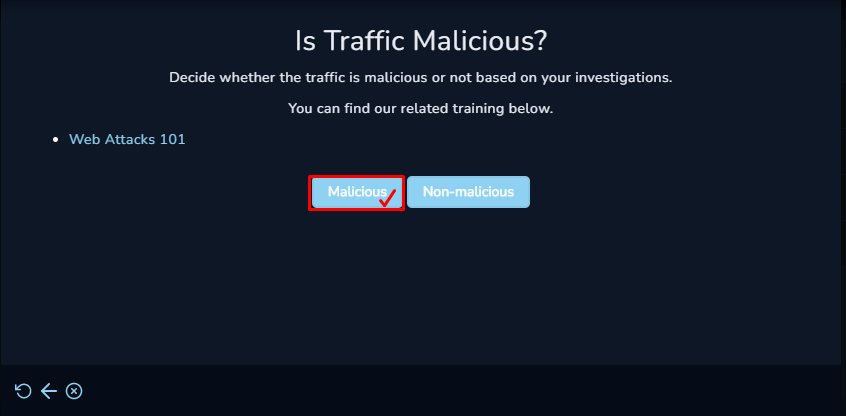

# WriteUp---SOC168---Whoami-Command-Detected-in-Request-Body
* *This repository contains the writeup to a practice case for SOC-Analyst at LetsDefend.io. Writeup includes a thorough detail of command injection attack and how the detection was successful.*
* *All the questions from the playbook after creatring and owning the case have been answered in this writeup one by one with details shown in the screenshot.*

# Create a New Case and Start PlayBook

  Following are the things that as a SOC Analyst you should be aware of before getting into the detection of alerts: 

 Understand that why the Alert Was triggered

 Gather information to understand traffic flow

 Now the most important is monitoring the traffic for the source IP address and determining weather it is malicious or not

 To Examine Weather the traffic was malicious or not we took the source IP address from the alert details

 To check malicious activity search the source IP in log management and Check *Raw Logs*.

 I found some of the logs where commands like *'ls'*, *'whoami'* & *'/etc/shadow'* were used.

 This answers our *First Question* from the playbook: *Is Traffic Malicious?*
 *Answer: Yes - Malicious* 

  The 2nd Question in the playbook is *What is the Attack Type?* Since we already know due to the answer to the previous question that certain commands like *whoami*, */etc/shadows* were used that are terminal commands, Hence the attack type can be determined easily. 

 *Answer: AttackType - Command Injection* 

  Third Question : *Check If it is a Planned Test* 

  We know the source IP from the alert details so we searched the source IP address in the *Endpoint Security tab*. But since we found nothing related to the source IP address, it is safe to assume that the attack was not Planned. 

 *Answer: Not planned.* 

*What is the Direction of the Attack?* 
Since we are investigating an attack on a web application and the attack type is command injection it is safe to assume that the attck is from internet (from hacker anywhere on the internet) and we also have the IP of the source where the attack came from cofirming that the direction of attack is Internet ---> Company Network. 

 Next Question is that *Was the attack successful?* 

  For checking if the attack was successful or not we need to check the command history on the destination IP. If the commands that we found in raw logs of the source IP are the same as in the command history then it can be said that the attack was successful. And look what I found in the command History of the destination IP address. 

  As the commands in the raw logs of source IP are the same as the commands executed on destinations' system, It is safe to say that the attack was successful 

  Now that we know that the attack was successful, therefore there is a pretty good chance that other devices from the company may get contaminated due to the device got compromised. So the next step is the containment of the target machine so further devices do not get compromised during the investigation phase. 

  For containing the destination Ip address we need to:
* Move to the Endpoint Security Tab
* search for the destination Ip to contain the host
* And Request the containment of the Host 

  The work is almost done. The only thing left is to suggest that wether the Tier 2 escalation is needed or not. 
Since the attack was successful as we investigated above, there is a need of further investigation because we were only able to detect the type of attack. Hence yes we need tier to escalation. 

